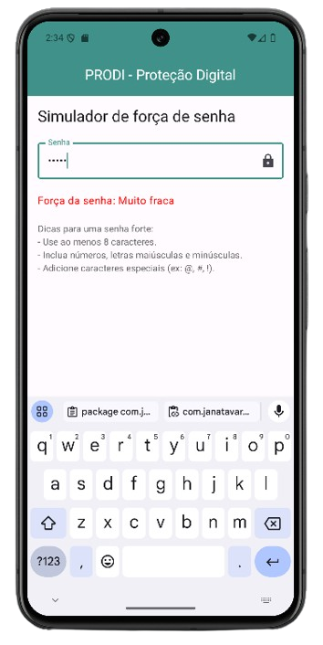
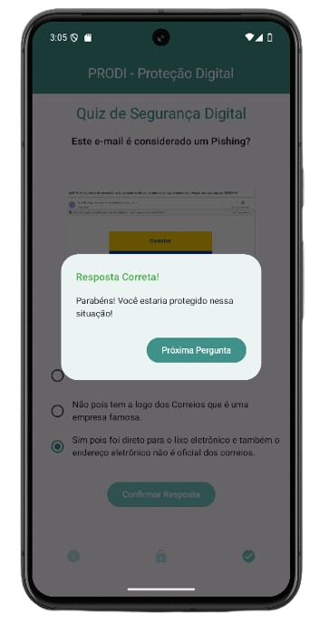
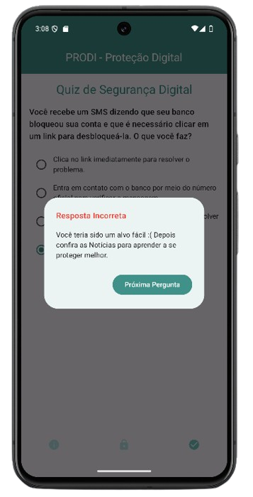
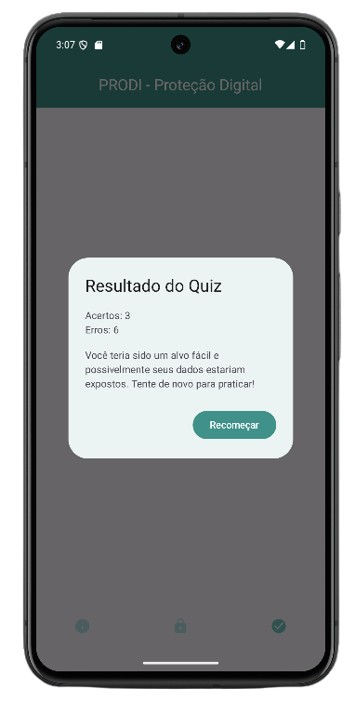

# PRODI - Proteção Digital
## PRODI - Proteção Digital é um aplicativo educativo desenvolvido em Kotlin com Jetpack Compose, projetado para conscientizar os usuários sobre diferentes tipos de ataques cibernéticos e ensinar práticas de segurança para proteger sua navegação na internet e suas informações pessoais.

### Funcionalidades

- **Aba de Notícias:** Exibe uma lista de cards com notícias informativas. Ao clicar em um card, o usuário pode visualizar a notícia completa para leitura.
- **Simulador de Senhas:** Permite que o usuário digite uma senha para verificar sua força (fraca, média ou forte), oferecendo feedback e dicas de melhoria.
- **Quiz Educativo:** Um quiz interativo que testa o conhecimento do usuário sobre ataques cibernéticos. Ao final, o usuário recebe uma avaliação indicando se estaria protegido ou se seria um alvo fácil.

### Arquitetura
O projeto foi desenvolvido utilizando a arquitetura MVVM (Model-View-ViewModel), garantindo uma melhor organização do código e separação de responsabilidades.

### Tecnologias Utilizadas
- Kotlin
- Jetpack Compose
- Arquitetura MVVM

### Screenshots

**Tela Inicial**

**Tela de Notícias**

**Detalhes da Notícia**

**Simulador de Senhas**

**Quiz Educativo**

### Como Executar o Projeto
Clone o repositório:
git clone https://github.com/seu-usuario/prodi-protecao-digital.git
Importe o projeto no Android Studio.
Conecte um dispositivo ou inicie um emulador.
Compile e execute o projeto.
